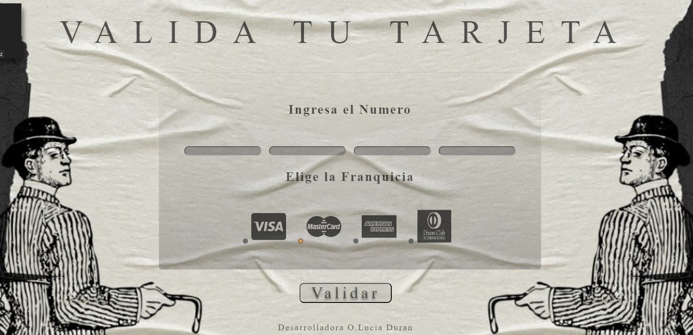

# Tarjeta de crédito válida

## Índice

* [1. Preámbulo](#1-preámbulo)
* [2. Resumen del proyecto](#2-resumen-del-proyecto)
* [3. Consideraciones técnicas](#3-consideraciones-técnicas)
* [4. Prototipos](#4-prototipos)
* [5. Diseño final para los usuarios](#5-diseño-final-para-los-usuarios)

***

## 1. Preámbulo

El [algoritmo de Luhn](https://es.wikipedia.org/wiki/Algoritmo_de_Luhn),
también llamado algoritmo de módulo 10, es un método de suma de verificación,
se utiliza para validar números de identificación; tales como el IMEI de los
celulares, tarjetas de crédito, etc.

Este algoritmo es simple. Obtenemos la reversa del número a verificar (que
solamente contiene dígitos [0-9]); a todos los números que ocupan una posición
par se les debe multiplicar por dos, si este número es mayor o igual a 10,
debemos sumar los dígitos del resultado; el número a verificar será válido si
la suma de sus dígitos finales es un múltiplo de 10.


## 2. Resumen del proyecto

El proyecto consistió en el desarrollo de una aplicación web que permite a los usuarios validar números de tarjetas de crédito y ocultar todos los dígitos excepto los últimos cuatro. La temática y funcionalidad fueron elegidas considerando situaciones de la vida real donde la validación de tarjetas es crucial.

### Los objetivos generales de este proyecto son los siguientes

* Construcción de una interfaz amigable: Se diseñó una interfaz intuitiva con pantallas claras, explicaciones concisas y mensajes informativos para guiar a los usuarios a través del proceso de validación de tarjetas de crédito.

* Experiencia de usuario eficiente: Se implementó una funcionalidad que permite ocultar todos los dígitos de la tarjeta excepto los últimos cuatro, manteniendo la privacidad de la información mientras se proporciona una referencia visual útil.

* Fundamentos técnicos sólidos: Se aplicaron conceptos de JavaScript, incluyendo variables, condicionales y funciones, así como manipulación del DOM y eventos, para lograr la validación de tarjetas de crédito de manera efectiva.

* Mejora de la calidad del código: Se utilizaron herramientas como linters y pruebas unitarias para mantener un código limpio, legible y funcional, garantizando la calidad y robustez del proyecto.

* Manejo de versiones y organización eficiente: Se implementó control de versiones utilizando Git y GitHub, aprovechando la estructura de carpetas y módulos en JavaScript para organizar el proyecto de manera eficiente y escalable.

## Resultado:

El proyecto finalizado ofrece una aplicación web completamente funcional que cumple con el propósito de validar números de tarjetas de crédito, brindando una experiencia de usuario fluida y segura. Se logró una combinación exitosa entre la funcionalidad técnica, la experiencia del usuario y las mejores prácticas de desarrollo, proporcionando una herramienta útil y eficiente para la validación de tarjetas de crédito en situaciones reales.

## 3. Consideraciones técnicas

La lógica del proyecto esta implementada completamente en JavaScript.

estructura:

```text
./
├── .babelrc
├── .editorconfig
├── .eslintrc
├── .gitignore
├── README.md
├── package.json
├── src
│   ├── validator.js
│   ├── index.html
│   ├── index.js
│   └── style.css
└── test
    ├── .eslintrc
    └── validator.spec.js
```

## 4. Prototipos
Aca se implementa los multiples diseños que se presentaron a lo largo de la creacion del proyecto tanto en creacion como lo generado incialmente desde FIGMA.

### FIGMA:


### MODIFICACIONES A LO LARGO DEL PROYECTO:



## 5. Diseño final para los usuarios

## VISTA


